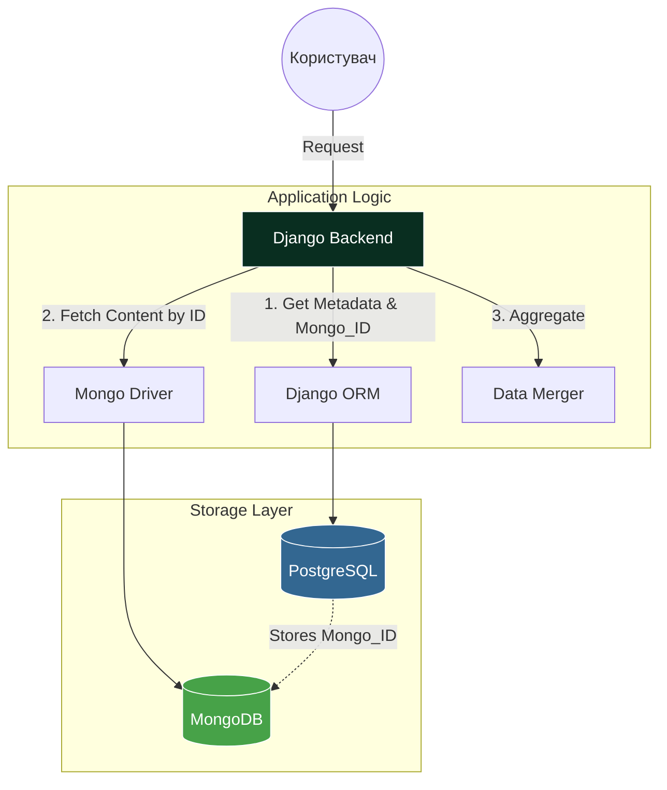

# Гібридна система зберігання даних

Для платформи **Smart-Study** реалізовано комбінований підхід до зберігання даних, що поєднує реляційну базу даних \*
\*PostgreSQL** та документо-орієнтовану базу **MongoDB\*\*. Це дозволяє оптимізувати архітектуру під різні типи навантажень
та структур даних.

## 1. Обґрунтування вибору

Розподіл даних між двома системами базується на принципі відповідності інструменту конкретній задачі:

| Критерій                  | PostgreSQL (Реляційна)                                 | MongoDB (NoSQL)                                                |
| :------------------------ | :----------------------------------------------------- | :------------------------------------------------------------- |
| **Зона відповідальності** | Користувачі, підписки, метадані курсів та проходження. | Детальна структура курсів, ієрархія модулів, запитання тестів. |
| **Характер даних**        | Чітко структуровані дані з жорсткими зв'язками.        | Гнучкі, вкладені структури зі змінним набором полів.           |
| **Переваги**              | ACID-транзакції, гарантована цілісність даних.         | Висока швидкість читання вкладених об'єктів.                   |

---

## 2. Логіка взаємодії баз даних

Система побудована за принципом, де PostgreSQL зберігає реєстр усіх сутностей та вказівники (ідентифікатори) на їх
розширений контент у MongoDB.

### Схема потоків даних

### 2.1. Використання PostgreSQL

У реляційній базі зберігається "скелет" системи та реєстр посилань:

- **Автентифікація:** Моделі користувачів, токени та права доступу (RBAC).
- **Вказівники (Explicit Mapping):** Таблиці курсів та модулів містять поля для зберігання ідентифікаторів MongoDB (
  наприклад, `structure_id`), що дозволяє бекенду точно знати, який документ у NoSQL сховищі відповідає запису в SQL.
- **Агрегація:** Дані для фільтрації та пошуку (категорії курсів, рейтинги, рівні складності), що дозволяє
  використовувати потужні
  засоби SQL для аналітики.

### 2.2. Використання MongoDB

У NoSQL базі зберігаються дані, які мають деревовидну структуру або вимагають частої зміни схеми:

- **Конструктор курсів:** Послідовність модулів, уроків та тестів. Збереження всієї ієрархії дозволяє швидко отримати
  структуру курсу.
- **Гнучкі тести:** Питання тестів можуть мати різні типи (одиничний вибір, множинний), містити пояснення або посилання
  на зображення. MongoDB дозволяє зберігати такі об'єкти без створення надлишкових порожніх полів у реляційній базі.

---

## 3. Механізм зв'язку (Explicit Soft Links)

Зв'язок між даними в різних СУБД реалізовано на рівні прикладного коду бекенду через прямі посилання:

1. **Ідентифікація:** Кожна сутність, контент якої винесено в NoSQL, має унікальний `_id` у MongoDB.
2. **Посилання:** Це значення зберігається як строкове поле (ObjectId) безпосередньо в таблиці PostgreSQL.
3. **Гнучка збірка даних (Оптимізація запитів):** Маршрутизація запиту залежить від необхідних даних:
   - **Комбінований запит:** Якщо потрібні метадані + контент, Django
     спочатку йде в Postgres за метаданими та ID структури, а потім робить цільовий запит до MongoDB.
   - **Прямий запит:** Якщо клієнту потрібен виключно контент з MongoDB, а ідентифікатор (
     наприклад, `course_id`) вже відомий із параметрів запиту, бекенд звертається **напряму до MongoDB**, повністю
     минаючи PostgreSQL. Це дозволяє уникнути зайвих навантажень на реляційну базу.

---

## 4. Результати впровадження

- **Швидкість доступу:** Пряме посилання на ID документа в MongoDB дозволяє бекенду отримувати складні структури
  миттєво, уникаючи складних пошукових запитів.
- **Стійкість до змін:** Додавання нових типів контенту (наприклад, нових типів питань у тести) не потребує складних
  міграцій структури таблиць у PostgreSQL.
- **Ефективне масштабування:** Можливість окремо оптимізувати роботу з профілями користувачів (Postgres) та роботу з
  великим масивом навчальних матеріалів (Mongo).
