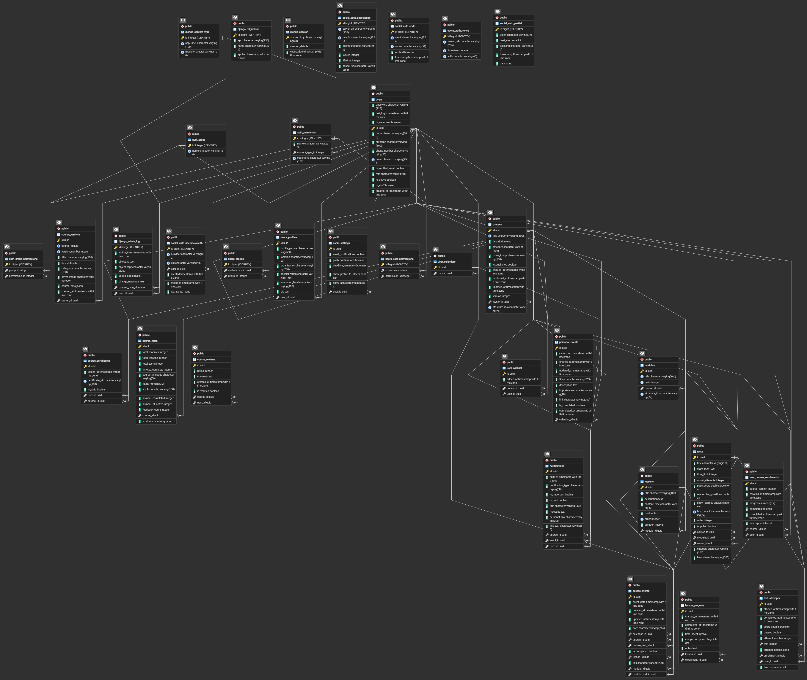
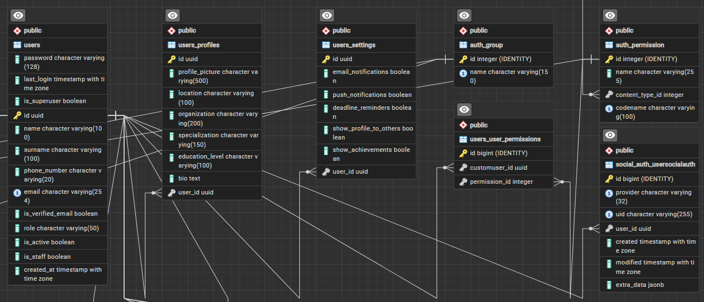
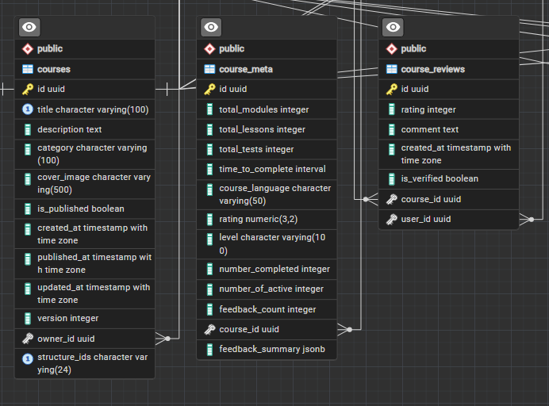
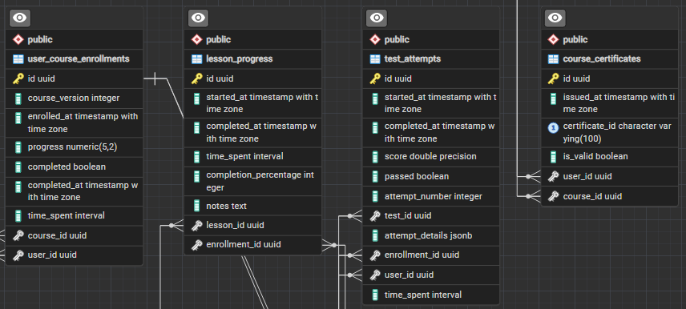
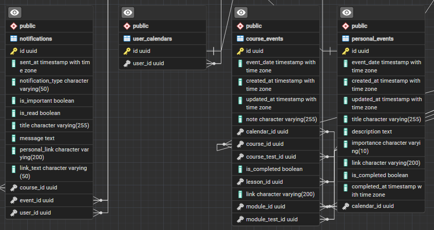

# Проєктування реляційної бази даних (PostgreSQL)

Основним сховищем для структурованих даних, профілів користувачів та метаданих навчального процесу в платформі \*
\*Smart-Study** є реляційна база даних **PostgreSQL\*\*. Її використання гарантує виконання вимог ACID, надійність
збереження ідентифікаційних даних та історії прогресу, а також забезпечує строгу перевірку цілісності зв'язків (Foreign
Keys).

## 1. Загальна ER-діаграма бази даних

Нижче наведена повна Entity-Relationship діаграма, яка відображає архітектуру всіх реляційних таблиць системи, включаючи
системні таблиці фреймворку (керування міграціями, сесіями) та кастомні таблиці предметної області.

---

## 2. Ключові доменні підсистеми (Business Entities)

Для кращого розуміння архітектури, монолітна схема бази даних логічно розділена на декілька ключових підсистем (Apps).

### 2.1. Підсистема користувачів та безпеки (`users`, `auth`)

Цей модуль відповідає за автентифікацію, авторизацію, профілі та інтеграцію соціальних мереж.

- **`users`** та **`users_profiles`**: Розділення базових даних автентифікації (email, пароль) та розширеної інформації
  профілю користувача.
- **`users_settings`**: Індивідуальні налаштування платформи для кожного користувача.
- **`auth_group` / `auth_permission`**: Реалізують систему Role-Based Access Control (RBAC), дозволяючи гнучко
  налаштовувати права доступу.
- **`social_auth_*`**: Група таблиць для забезпечення входу через сторонні сервіси (Google/Facebook OAuth).

### 2.2. Метадані навчального контенту (`courses`)

Хоча сама структура модулів лежить у MongoDB, реєстр усіх навчальних матеріалів знаходиться тут. Це дозволяє швидко
виконувати пошук та фільтрацію в каталозі.

- **`courses`** та **`course_meta`**: Головні сутності навчального процесу. Містять назву, опис, рівень складності та
  посилання на автора. Містять ідентифікатори (Soft Links) на документи у MongoDB.
- **`course_reviews`**: Відгуки студентів. Пов'язана відношенням Many-to-One з курсом та користувачем для розрахунку
  рейтингу.

### 2.3. Прогрес та підписки (Enrollments & Progress)

Ця підсистема фіксує всі інтеракції користувача з навчальним контентом.

- **`user_course_enrollments`**: Зв'язуюча таблиця (Many-to-Many) між користувачем та курсом. Зберігає статус підписки
  та загальний прогрес.
- **`lesson_progress`** та **`test_attempts`**: Деталізований трекінг. Зберігають статус проходження кожного окремого
  уроку та результати спроб складання тестів.
- **`course_certificates`**: Реєстр виданих дипломів з унікальними UUID для підтвердження валідності.
- **`user_wishlist`**: Таблиця для збереження курсів, які студент планує пройти в майбутньому.

### 2.4. Сповіщення та розклад (`notifications`, `calendars`)

Модуль для управління часом та зворотним зв'язком.

- **`notifications`**: Зберігає повідомлення користувачів (Повідомлення від автора курсу, нагадування про власно
  заплановану подію).
- **`user_calendars`**, **`course_events`**, **`personal_events`**: Гнучка система розкладу. Розділяє глобальні події
  курсу (наприклад, дедлайни) та особисті події студента у його власному календарі.

---

## 3. Забезпечення цілісності та оптимізація

Для стабільної роботи системи під навантаженням на рівні бази даних налаштовано:

1. **Foreign Key Constraints (Обмеження зовнішніх ключів):** Широко використовуються правила `ON DELETE CASCADE` (
   наприклад, при видаленні курсу автоматично видаляються всі підписки на нього).
2. **Індексування (B-Tree Indexes):** Індекси додані до полів, які найчастіше беруть участь у вибірках (наприклад,
   `user_id` у таблицях прогресу, `email` для авторизації).
3. **Унікальні обмеження (Unique Constraints):** Реалізовано захист від дублювання даних на рівні СУБД (наприклад,
   заборона одному користувачу бути підписаним на один і той самий курс двічі одночасно).
